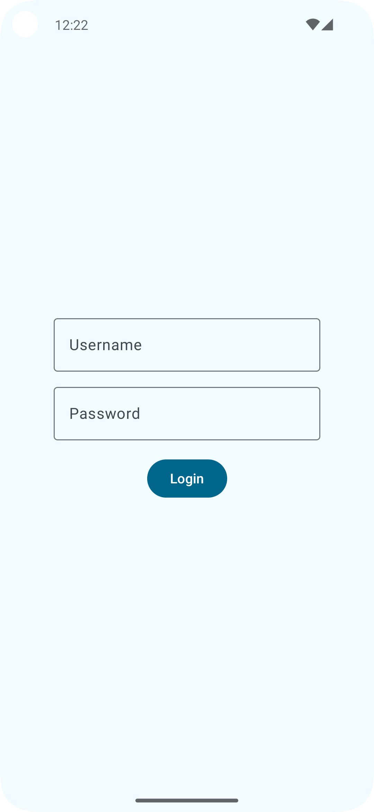
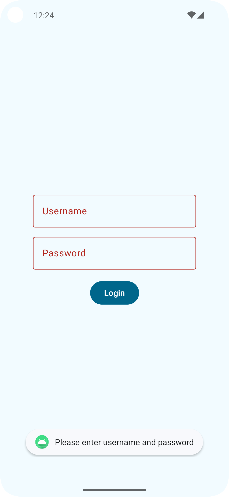
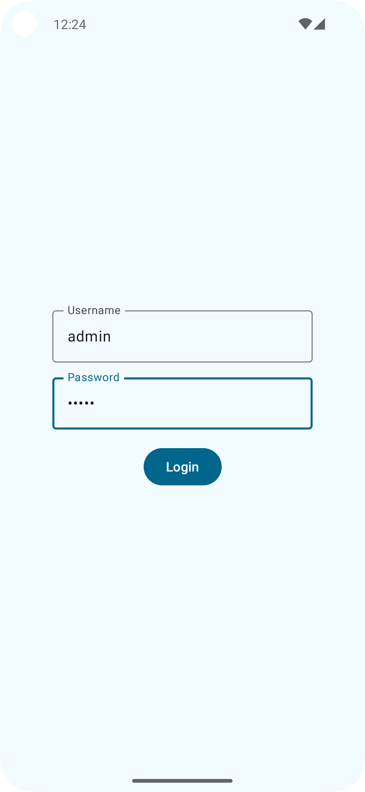
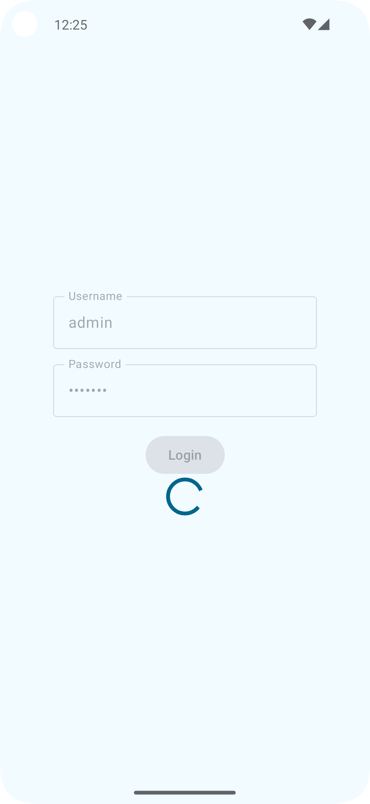
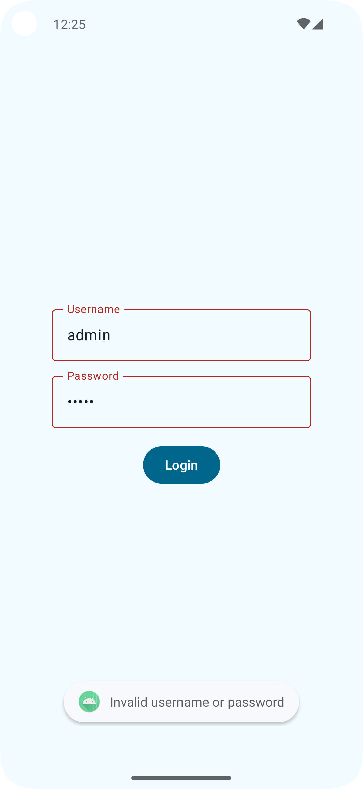

# Login Sample

This is a simple Android application that demonstrates a basic login flow using Jetpack Compose, ViewModel, and coroutines.

## Features

* Username and password authentication
* Loading state during authentication
* Error handling for invalid credentials and empty fields
* Navigation to a welcome screen upon successful login## Architecture

The project follows the MVVM (Model-View-ViewModel) architecture:

* **UI (View):** Implemented using Jetpack Compose.
* **ViewModel:** Handles the login logic and state management.
* **Repository:** Provides data access (in this case, a simple in-memory authentication).

## Screenshots

| Screenshot | Description | Image |
|---|---|---|
| Initial State | The login screen when the app is first launched. |  |
| Validation Errors| The login screen with empty fields, highlighting validation errors. |  |
| Input Provided | The login screen with username and password entered. |  |
| Authentication in Progress | The login screen displaying a loading indicator during authentication. |  |
| Authentication Error | The login screen showing an error message after an unsuccessful login attempt. |  |
| Successful Login | The welcome screen displayed after a successful login. |  |

## Dependencies

* Jetpack Compose
* ViewModel
* Coroutines
* Material Design 3

## Getting Started

1. Clone the repository: `git clone https://github.com/your-username/login-sample.git`
2. Open the project in Android Studio.
3. Build and run the app on an emulator or device.

## Usage

1. Enter a username and password.
2. Click the "Login" button.
3. If the credentials are valid (username = admin, password = password), you will be navigated to a welcome screen.
4. If the credentials are invalid or the fields are empty, an error message will be displayed.

## Testing

The project includes unit tests for the ViewModel and repository using JUnit and coroutines.

## Future Improvements

* Implement a real backend authentication system.
* Add support for password visibility toggle.
* Implement "Remember Me" functionality.
* Improve error handling and feedback to the user.
